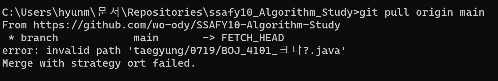

## SignalStudy

<table >
  <tr>
    <td>진행 기간</td>
    <td>2023년 8월 2일 ~ ing </td>
  </tr>
  <tr>
    <td>스터디 장소</td>
    <td>신호동 카페</td>
  </tr>
  <tr>
    <td>정기 스터디 시간</td>
    <td>매주 목,금( 오후 7시 30분 )</td>
  </tr>
  <tr>
    <td>언어</td>
    <td>
     PYTHON, JAVA
    </td>
  </tr>
</table>

 

### 💻️ 스터디 멤버

<table>
 <tr>
    <td align="center"></td>
    <td align="center"><a href="https://github.com/SeoJunHa96"></td>
    <td align="center"></td>
    <td align="center"></td>
   <td align="center"></td>
  </tr>
  <tr>
    <td align="center"><a href="https://github.com/hwalang"><b>hwalang</b></a></td>
    <td align="center"><a href="https://github.com/SeoJunHa96"><b>SeoJunHa96</b></a></td>
    <td align="center"></td>
    <td align="center"></td>
    <td align="center"></td>
  </tr>
  <tr> 
    <td align="center">JAVA</td>
    <td align="center">PYTHON</td>
    <td align="center">PYTHON</td>
    <td align="center">PYTHON</td>
    <td align="center">PYTHON</td>
    <!-- <td align="center"> </td> -->
  </tr> 
</table>

 

### 📌 스터디 규칙

    1. 생성된 원격 저장소에 `본인이름`으로 폴더를 생성한다.
    2. 알고리즘 풀이 후 원격 저장소 자신의 폴더에 풀이한 소스 코드를 `push` 한다.
    3. commit할 때 `commit convention`을 지킨다.
    4. (option) 다른 사람들의 코드를 보고 자유롭게 코드리뷰를 한다.

 

### 📁 Repository 폴더 구조

- Github ID/날짜/소스코드(플랫폼, 문제 번호와 제목 명시)

  ##### 💡 예시 : `jaewonwi/0720/BOJ_1000_A+B.java`

 

### 📝 commit 컨벤션

- 백준_번호_문제이름

  ##### 💡 예시 : `BOJ_1000_A+B`

 
 

### ☝️ 일부 폴더만 pull/push 하는 방법
    1. 로컬에 프로젝트 폴더 하나 생성
    2. git init
    3. git remote add origin https://github.com/hwalang/SignalStudy.git
    4. git sparse-checkout init
    5. git sparse-checkout set `hwalang` << 자기 이름 폴더로 변경하면 됨
    6. git sparse-checkout list // set 되었는지 확인 한다.
        6.1. git branch -m master main  // 현재 branch 를 git 과 맞춰준다.
    7. git pull origin main

    8. 로컬에 생성되었는지 확인
    9. .gitignore 생성하기
    10. 제외항목
        10.1. /public
        10.2. /README.md
        10.3. /.gitignore

    11.  commit/push 진행
        11.1. git add `( '.' or add file path)`  : '.'은 변경사항 전체를 의미, 
        11.2. git commit -m "`(commit message)`" : 📌commit convention
        11.3. git pull origin main
        11.4. git push origin main
        📌 pull 하지 않고 commit -> push 단계를 밟았다간 git repository 의 내용이 날라갈 수 있으니 조심!!

 

### ⚠️ invalid path error 발생 

</img> 

- windows 환경 git에서는 ?와 같은 특수문자가 포함되어 있으면 정상적으로 작동이 되지 않는다고 한다.

- 해결방법은 간단하다. 다음 코드를 순서대로 실행시키면 된다.
1. > git config core.protectNTFS false
2. > git checkout -f HEAD

 

### .gitignore
- .gitignore 파일을 이용해서 .py 파일만 git repository 에 올려야 합니다. 
- gitignore.io 사이트에서 파일 양식을 받거나 검색 필수 !!
- .gitignore 파일도 git repository 에 올리는 실수를 하시면 안 됩니다 !!

#### 1. python
다른 분들을 위해서 잘 작동하는 .gitignore 파일을 저처럼 올려주세요 
ignore 파일을 올리면 이 글은 삭제해주세요 

#### 2. java
##### 예시
.java 파일만 올리기 위해서 아래와 같은 .gitignore 파일을 작성

    /bin/   
    /.settings/   
    .project   
    .classpath   
    .gitignore   
